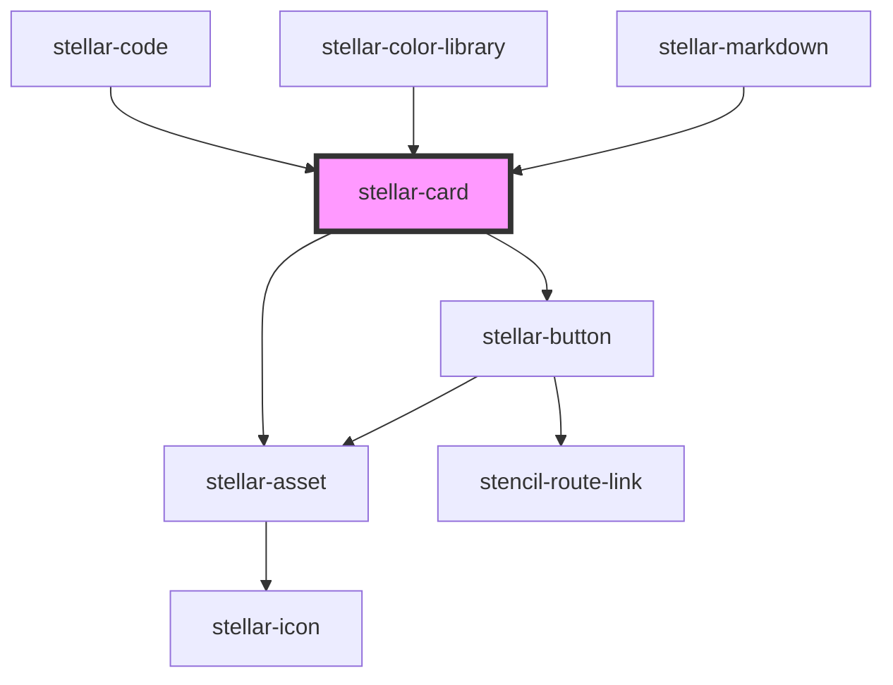

# stellar-card

<!-- Auto Generated Below -->

## Usage

### Default

<stellar-card>
    <h1>Hey! Awesome!</h1>
</stellar-card>

### Flippable

<stellar-card flippable>
    

        <header>
            <h6>header</h6>
        </header>
        <section>
            <h6>body</h6>
        </section>
        <footer>
            <h6>footer</h6>
        </footer>
    

    

        <header>
            <h6>back header</h6>
        </header>
        <section>
            <h6>back body</h6>
        </section>
        <footer>
            <h6>back footer</h6>
        </footer>
    

</stellar-card>

### Header-footer

<stellar-card>
    <header>
        <h6>header</h6>
    </header>
    <section>
        <h6>body</h6>
    </section>
    <footer>
        <h6>footer</h6>
    </footer>
</stellar-card>

## Properties

| Property    | Attribute   | Description                                                                 | Type                                                 | Default     |
| ----------- | ----------- | --------------------------------------------------------------------------- | ---------------------------------------------------- | ----------- |
| `flip_icon` | `flip_icon` | Sets the href on the anchor tag if the button is a link.                    | `string`                                             | `"cog"`     |
| `flippable` | `flippable` | Let's a card be flippable                                                   | `boolean`                                            | `false`     |
| `flipped`   | `flipped`   | Renders a flipped card                                                      | `boolean`                                            | `false`     |
| `for`       | `for`       | Sets the href on the anchor tag if the button is a link.                    | `string`                                             | `undefined` |
| `href`      | `href`      | Sets the href if the card is a link.                                        | `string`                                             | `"#"`       |
| `name`      | `name`      | Sets the name if the card is a button.                                      | `string`                                             | `""`        |
| `padding`   | `padding`   | Sets the padding inside of the button. Can be small, medium, or large.      | `"large" \| "medium" \| "none" \| "small" \| "tiny"` | `"medium"`  |
| `shadow`    | `shadow`    | Renders a shadow on the card                                                | `"heavy" \| "light" \| "medium"`                     | `"medium"`  |
| `tag`       | `tag`       | Sets the element to render the card as - an anchor tag, a button, or a div. | `"a" \| "button" \| "div" \| "stencil-route-link"`   | `"div"`     |
| `type`      | `type`      | Sets the type on a button                                                   | `string`                                             | `undefined` |
| `value`     | `value`     | Sets the value if the card is a button.                                     | `string`                                             | `"#"`       |

## Events

| Event  | Description | Type               |
| ------ | ----------- | ------------------ |
| `flip` |             | `CustomEvent<any>` |

## Methods

### `flip_card(e?: UIEvent) => Promise<void>`

#### Returns

Type: `Promise<void>`

## Dependencies

### Used by

 - [stellar-code](../../helpers/code)
 - [stellar-color-library](../../helpers/color-library)
 - [stellar-markdown](../../helpers/markdown)

### Depends on

- [stellar-button](../../forms/button)
- [stellar-asset](../asset)

### Graph

----------------------------------------------

*Built with [StencilJS](https://stenciljs.com/)*
