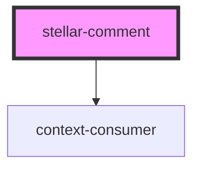

# single-comment

<!-- Auto Generated Below -->

## Properties

| Property  | Attribute | Description | Type      | Default        |
| --------- | --------- | ----------- | --------- | -------------- |
| `content` | `content` |             | `any`     | `"Loading..."` |
| `dark`    | `dark`    |             | `boolean` | `false`        |
| `name`    | `name`    |             | `any`     | `"Loading..."` |

## Dependencies

### Depends on

- context-consumer

### Graph

----------------------------------------------

*Built with [StencilJS](https://stenciljs.com/)*
