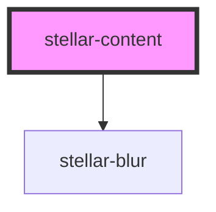

# stellar-content

<!-- Auto Generated Below -->

## Properties

| Property   | Attribute  | Description | Type      | Default     |
| ---------- | ---------- | ----------- | --------- | ----------- |
| `behavior` | `behavior` |             | `string`  | `undefined` |
| `for`      | `for`      |             | `string`  | `undefined` |
| `open`     | `open`     |             | `boolean` | `false`     |

## Dependencies

### Depends on

- [stellar-blur](../../motion/blur)

### Graph

----------------------------------------------

*Built with [StencilJS](https://stenciljs.com/)*
