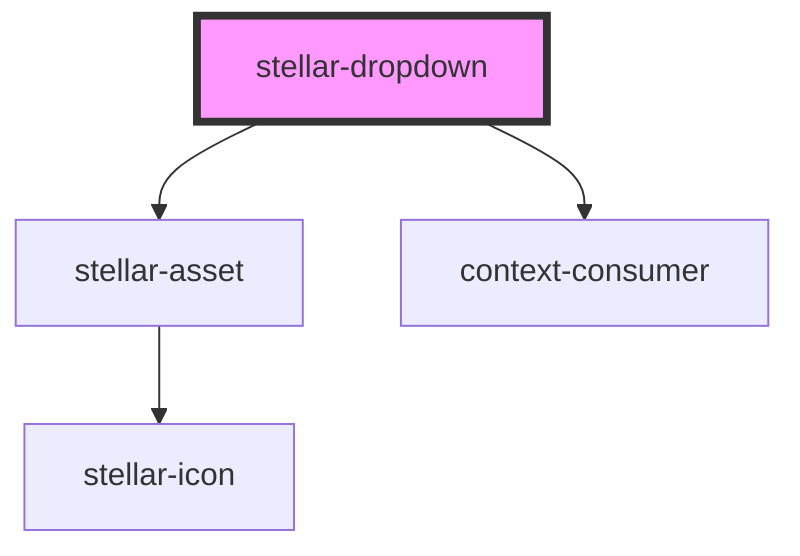

# stellar-button

<!-- Auto Generated Below -->

## Usage

### Default

<stellar-dropdown>
	<stellar-button ghost slot="handle">Account</stellar-button>
	<stellar-item>
		<stellar-avatar name="William M. Riley" size="small" notooltip></stellar-avatar>
		Your Account
	</stellar-item>
	<stellar-item>Billing</stellar-item>
	<stellar-item selectable="false" slot="footer">
		<stellar-button pill outline block size="tiny" padding="small">Sign out</stellar-button>
	</stellar-item>
</stellar-dropdown>

### Positioning

<stellar-dropdown position="left">
	<stellar-button ghost slot="handle">Account</stellar-button>
	<stellar-item>
		<stellar-avatar name="William M. Riley" size="small" notooltip></stellar-avatar>
		Your Account
	</stellar-item>
	<stellar-item>Billing</stellar-item>
	<stellar-item>Settings</stellar-item>
	<stellar-item selectable="false" slot="footer">
		<stellar-button pill outline block size="tiny" padding="small">Sign out</stellar-button>
	</stellar-item>
</stellar-dropdown>

 

<stellar-dropdown position="right">
	<stellar-button ghost slot="handle">Account</stellar-button>
	<stellar-item>
		<stellar-avatar name="William M. Riley" size="small" notooltip></stellar-avatar>
		Your Account
	</stellar-item>
	<stellar-item>Billing</stellar-item>
	<stellar-item>Settings</stellar-item>
	<stellar-item selectable="false" slot="footer">
		<stellar-button pill outline block size="tiny" padding="small">Sign out</stellar-button>
	</stellar-item>
</stellar-dropdown>

## Properties

| Property   | Attribute   | Description | Type                            | Default        |
| ---------- | ----------- | ----------- | ------------------------------- | -------------- |
| `dark`     | `dark`      |             | `boolean`                       | `false`        |
| `icon`     | `icon`      |             | `boolean`                       | `false`        |
| `iconName` | `icon-name` |             | `string`                        | `"arrow-down"` |
| `label`    | `label`     |             | `string`                        | `"Dropdown"`   |
| `open`     | `open`      |             | `boolean`                       | `false`        |
| `position` | `position`  |             | `"center" or "left" or "right"` | `"center"`     |

## Dependencies

### Depends on

- [stellar-asset](../asset)
- context-consumer

### Graph

----------------------------------------------

*Built with [StencilJS](https://stenciljs.com/)*
