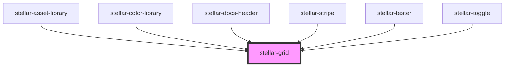

# stellar-grid

<!-- Auto Generated Below -->

## Usage

### Default

<stellar-grid>
    <stellar-card>nice</stellar-card>
    <stellar-card>nice</stellar-card>
    <stellar-card>nice</stellar-card>
    <stellar-card>nice</stellar-card>
    <stellar-card>nice</stellar-card>
    <stellar-card>nice</stellar-card>
    <stellar-card>nice</stellar-card>
</stellar-grid>

## Properties

| Property            | Attribute            | Description | Type               | Default          |
| ------------------- | -------------------- | ----------- | ------------------ | ---------------- |
| `align`             | `align`              |             | `string`           | `"items-start"`  |
| `cols`              | `cols`               |             | `number \| string` | `"auto"`         |
| `compact`           | `compact`            |             | `boolean`          | `false`          |
| `noresponsive`      | `noresponsive`       |             | `boolean`          | `false`          |
| `padding`           | `padding`            |             | `boolean`          | `false`          |
| `swappable`         | `swappable`          |             | `boolean`          | `false`          |
| `swappableSelector` | `swappable-selector` |             | `string`           | `"stellar-card"` |

## Events

| Event          | Description | Type               |
| -------------- | ----------- | ------------------ |
| `orderChanged` |             | `CustomEvent<any>` |

## Methods

### `refresh() => Promise<void>`

#### Returns

Type: `Promise<void>`

## Dependencies

### Used by

 - [stellar-asset-library](../../helpers/asset-library)
 - [stellar-color-library](../../helpers/color-library)
 - [stellar-docs-header](../../docs/header)
 - [stellar-stripe](../../helpers/stripe)
 - [stellar-tester](../../tester)
 - [stellar-toggle](../../forms/toggle)

### Graph

----------------------------------------------

*Built with [StencilJS](https://stenciljs.com/)*
