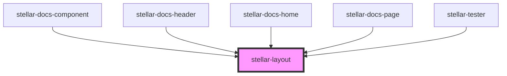

# stellar-layout

<!-- Auto Generated Below -->

## Usage

### Default

<stellar-layout>
    <aside class="bg-theme-3"></aside>
    <section class="bg-theme-5"></section>
</stellar-layout>

## Properties

| Property  | Attribute | Description | Type                                                                        | Default      |
| --------- | --------- | ----------- | --------------------------------------------------------------------------- | ------------ |
| `align`   | `align`   |             | `"baseline" \| "bottom" \| "center" \| "top"`                               | `"baseline"` |
| `content` | `content` |             | `"baseline" \| "bottom" \| "center" \| "top"`                               | `"baseline"` |
| `hasNav`  | `has-nav` |             | `boolean`                                                                   | `undefined`  |
| `height`  | `height`  |             | `"fill"`                                                                    | `undefined`  |
| `padding` | `padding` |             | `"large" \| "medium" \| "none" \| "small" \| "tiny"`                        | `"medium"`   |
| `size`    | `size`    |             | `"flush" \| "full" \| "large" \| "medium" \| "small" \| "tiny" \| "xlarge"` | `"medium"`   |
| `type`    | `type`    |             | `string`                                                                    | `undefined`  |

## Methods

### `refresh() => Promise<void>`

#### Returns

Type: `Promise<void>`

## Dependencies

### Used by

 - [stellar-docs-component](../../docs/component)
 - [stellar-docs-header](../../docs/header)
 - [stellar-docs-home](../../docs/home)
 - [stellar-docs-page](../../docs/page)
 - [stellar-tester](../../tester)

### Graph

----------------------------------------------

*Built with [StencilJS](https://stenciljs.com/)*
