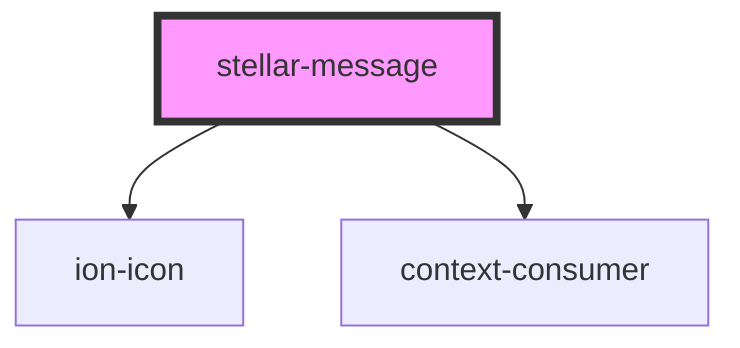

# stellar-message

<!-- Auto Generated Below -->

## Usage

### Default

<stellar-message>
  <ion-icon name="happy"></ion-icon>
  
Stellar is still an alpha product - some things may change!

  <stellar-button size="tiny" pill>Learn More</stellar-button>
</stellar-message>

### Striped

<stellar-message striped type="alert">
  <ion-icon name="happy"></ion-icon>
  
Stellar is still an alpha product - some things may change!

  <stellar-button size="tiny" pill>Learn More</stellar-button>
</stellar-message>

<stellar-message striped type="error">
  <ion-icon name="happy"></ion-icon>
  
Stellar is still an alpha product - some things may change!

  <stellar-button size="tiny" pill>Learn More</stellar-button>
</stellar-message>

<stellar-message striped type="info">
  <ion-icon name="happy"></ion-icon>
  
Stellar is still an alpha product - some things may change!

  <stellar-button size="tiny" pill>Learn More</stellar-button>
</stellar-message>

<stellar-message striped type="success">
  <ion-icon name="happy"></ion-icon>
  
Stellar is still an alpha product - some things may change!

  <stellar-button size="tiny" pill>Learn More</stellar-button>
</stellar-message>

### Types

<stellar-message type="alert">
  <ion-icon name="happy"></ion-icon>
  
Stellar is still an alpha product - some things may change!

  <stellar-button size="tiny" pill>Learn More</stellar-button>
</stellar-message>

<stellar-message type="error">
  <ion-icon name="happy"></ion-icon>
  
Stellar is still an alpha product - some things may change!

  <stellar-button size="tiny" pill>Learn More</stellar-button>
</stellar-message>

<stellar-message type="info">
  <ion-icon name="happy"></ion-icon>
  
Stellar is still an alpha product - some things may change!

  <stellar-button size="tiny" pill>Learn More</stellar-button>
</stellar-message>

<stellar-message type="success">
  <ion-icon name="happy"></ion-icon>
  
Stellar is still an alpha product - some things may change!

  <stellar-button size="tiny" pill>Learn More</stellar-button>
</stellar-message>

## Properties

| Property   | Attribute  | Description | Type                                        | Default     |
| ---------- | ---------- | ----------- | ------------------------------------------- | ----------- |
| `closable` | `closable` |             | `boolean`                                   | `true`      |
| `dark`     | `dark`     |             | `boolean`                                   | `false`     |
| `name`     | `name`     |             | `string`                                    | `"stellar"` |
| `remember` | `remember` |             | `boolean`                                   | `true`      |
| `shown`    | `shown`    |             | `boolean`                                   | `true`      |
| `size`     | `size`     |             | `"default" or "full"`                       | `undefined` |
| `striped`  | `striped`  |             | `boolean`                                   | `false`     |
| `type`     | `type`     |             | `"alert" or "error" or "info" or "success"` | `undefined` |

## Dependencies

### Depends on

- ion-icon
- context-consumer

### Graph

----------------------------------------------

*Built with [StencilJS](https://stenciljs.com/)*
