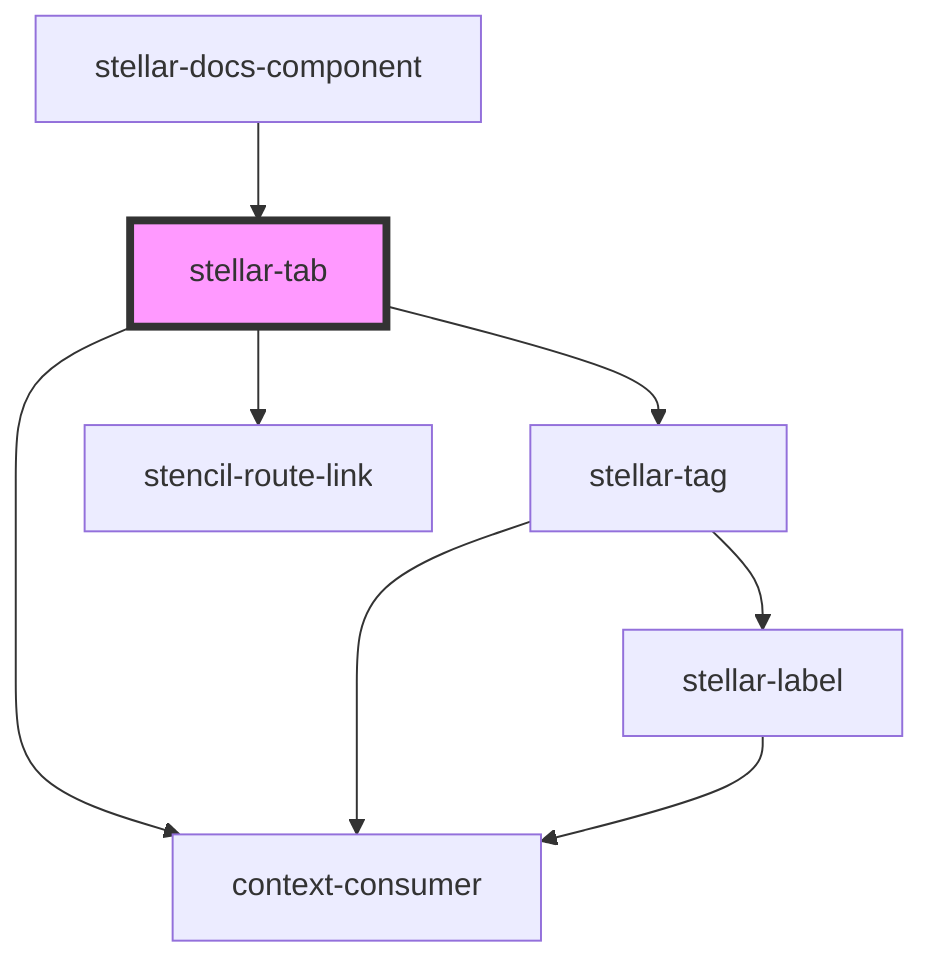

# stellar-content

<!-- Auto Generated Below -->

## Properties

| Property        | Attribute       | Description                                                | Type                                 | Default     |
| --------------- | --------------- | ---------------------------------------------------------- | ------------------------------------ | ----------- |
| `dark`          | `dark`          |                                                            | `boolean`                            | `false`     |
| `disabled`      | `disabled`      |                                                            | `boolean`                            | `false`     |
| `href`          | `href`          | Sets the href on the anchor tag if the button is a link.   | `string`                             | `'#'`       |
| `name`          | `name`          |                                                            | `string`                             | `undefined` |
| `notifications` | `notifications` |                                                            | `boolean \| number`                  | `false`     |
| `open`          | `open`          |                                                            | `boolean`                            | `false`     |
| `order`         | `order`         |                                                            | `number`                             | `undefined` |
| `tabCount`      | `tab-count`     |                                                            | `number`                             | `undefined` |
| `tag`           | `tag`           |                                                            | `"button" \| "link" \| "route-link"` | `"button"`  |
| `target`        | `target`        | Sets the target on the anchor tag if the button is a link. | `string`                             | `'_self'`   |
| `vertical`      | `vertical`      |                                                            | `boolean`                            | `false`     |

## Events

| Event           | Description | Type               |
| --------------- | ----------- | ------------------ |
| `contentChange` |             | `CustomEvent<any>` |

## Dependencies

### Used by

 - [stellar-docs-component](../../docs/component)

### Depends on

- [stellar-tag](../tag)
- stencil-route-link
- context-consumer

### Graph

----------------------------------------------

*Built with [StencilJS](https://stenciljs.com/)*
