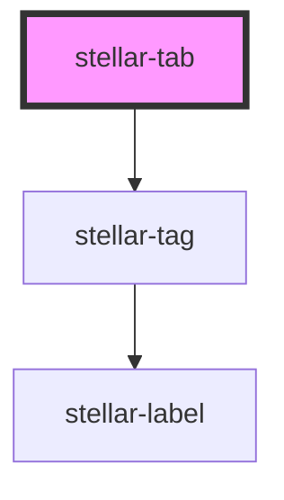

# stellar-content

<!-- Auto Generated Below -->

## Properties

| Property        | Attribute       | Description | Type                | Default     |
| --------------- | --------------- | ----------- | ------------------- | ----------- |
| `disabled`      | `disabled`      |             | `boolean`           | `false`     |
| `href`          | `href`          |             | `string`            | `"#"`       |
| `notifications` | `notifications` |             | `boolean \| number` | `false`     |
| `open`          | `open`          |             | `boolean`           | `false`     |
| `order`         | `order`         |             | `number`            | `undefined` |
| `tabCount`      | `tab-count`     |             | `number`            | `undefined` |
| `tag`           | `tag`           |             | `string`            | `"button"`  |

## Events

| Event           | Description | Type               |
| --------------- | ----------- | ------------------ |
| `contentChange` |             | `CustomEvent<any>` |

## Dependencies

### Depends on

- [stellar-tag](../tag)

### Graph

----------------------------------------------

*Built with [StencilJS](https://stenciljs.com/)*
