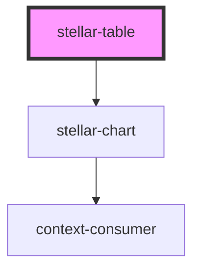

# stellar-table

<!-- Auto Generated Below -->

## Properties

| Property  | Attribute | Description | Type      | Default     |
| --------- | --------- | ----------- | --------- | ----------- |
| `chart`   | `chart`   |             | `boolean` | `false`     |
| `name`    | `name`    |             | `string`  | `undefined` |
| `striped` | `striped` |             | `boolean` | `false`     |
| `upgrade` | `upgrade` |             | `boolean` | `false`     |

## Dependencies

### Depends on

- [stellar-chart](../../helpers/chart)

### Graph

----------------------------------------------

*Built with [StencilJS](https://stenciljs.com/)*
