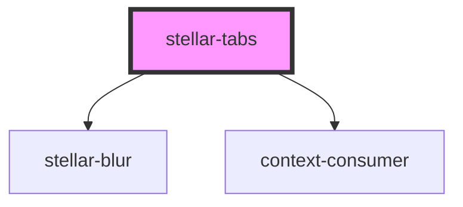

# stellar-content

<!-- Auto Generated Below -->

## Usage

### Block

<stellar-tabs block>
  <stellar-tab>
    <ion-icon name="person"></ion-icon>
    Profile
  </stellar-tab>
  <stellar-tab open>Details</stellar-tab>
  <stellar-tab>Payment</stellar-tab>
  <stellar-tab>
    <stellar-avatar size="tiny" shape="circle" notooltip name="William M. Riley"></stellar-avatar>
    William M. Riley
  </stellar-tab>
</stellar-tabs>

### Block-sizes

<stellar-tabs size="tiny" block>
  <stellar-tab>
    <ion-icon name="person"></ion-icon>
    Profile
  </stellar-tab>
  <stellar-tab open>Details</stellar-tab>
  <stellar-tab>Payment</stellar-tab>
  <stellar-tab>
    <stellar-avatar size="tiny" shape="circle" notooltip name="William M. Riley"></stellar-avatar>
    William M. Riley
  </stellar-tab>
</stellar-tabs>

<stellar-tabs size="small" block>
  <stellar-tab>
    <ion-icon name="person"></ion-icon>
    Profile
  </stellar-tab>
  <stellar-tab open>Details</stellar-tab>
  <stellar-tab>Payment</stellar-tab>
  <stellar-tab>
    <stellar-avatar size="tiny" shape="circle" notooltip name="William M. Riley"></stellar-avatar>
    William M. Riley
  </stellar-tab>
</stellar-tabs>

<stellar-tabs block>
  <stellar-tab>
    <ion-icon name="person"></ion-icon>
    Profile
  </stellar-tab>
  <stellar-tab open>Details</stellar-tab>
  <stellar-tab>Payment</stellar-tab>
  <stellar-tab>
    <stellar-avatar size="tiny" shape="circle" notooltip name="William M. Riley"></stellar-avatar>
    William M. Riley
  </stellar-tab>
</stellar-tabs>

<stellar-tabs size="medium" block>
  <stellar-tab>
    <ion-icon name="person"></ion-icon>
    Profile
  </stellar-tab>
  <stellar-tab open>Details</stellar-tab>
  <stellar-tab>Payment</stellar-tab>
  <stellar-tab>
    <stellar-avatar size="tiny" shape="circle" notooltip name="William M. Riley"></stellar-avatar>
    William M. Riley
  </stellar-tab>
</stellar-tabs>

<stellar-tabs size="large" block>
  <stellar-tab>
    <ion-icon name="person"></ion-icon>
    Profile
  </stellar-tab>
  <stellar-tab open>Details</stellar-tab>
  <stellar-tab>Payment</stellar-tab>
  <stellar-tab>
    <stellar-avatar size="tiny" shape="circle" notooltip name="William M. Riley"></stellar-avatar>
    William M. Riley
  </stellar-tab>
</stellar-tabs>

### Default

<stellar-tabs>
  <stellar-tab>
    <ion-icon name="person"></ion-icon>
    Profile
  </stellar-tab>
  <stellar-tab open>Details</stellar-tab>
  <stellar-tab>Payment</stellar-tab>
  <stellar-tab>
    <stellar-avatar size="tiny" shape="circle" notooltip name="William M. Riley"></stellar-avatar>
    William M. Riley
  </stellar-tab>
</stellar-tabs>

### Sizes

<stellar-tabs size="tiny">
  <stellar-tab>
    <ion-icon name="person"></ion-icon>
    Profile
  </stellar-tab>
  <stellar-tab open>Details</stellar-tab>
  <stellar-tab>Payment</stellar-tab>
  <stellar-tab>
    <stellar-avatar size="tiny" shape="circle" notooltip name="William M. Riley"></stellar-avatar>
    William M. Riley
  </stellar-tab>
</stellar-tabs>

<stellar-tabs size="small">
  <stellar-tab>
    <ion-icon name="person"></ion-icon>
    Profile
  </stellar-tab>
  <stellar-tab open>Details</stellar-tab>
  <stellar-tab>Payment</stellar-tab>
  <stellar-tab>
    <stellar-avatar size="tiny" shape="circle" notooltip name="William M. Riley"></stellar-avatar>
    William M. Riley
  </stellar-tab>
</stellar-tabs>

<stellar-tabs>
  <stellar-tab>
    <ion-icon name="person"></ion-icon>
    Profile
  </stellar-tab>
  <stellar-tab open>Details</stellar-tab>
  <stellar-tab>Payment</stellar-tab>
  <stellar-tab>
    <stellar-avatar size="tiny" shape="circle" notooltip name="William M. Riley"></stellar-avatar>
    William M. Riley
  </stellar-tab>
</stellar-tabs>

<stellar-tabs size="medium">
  <stellar-tab>
    <ion-icon name="person"></ion-icon>
    Profile
  </stellar-tab>
  <stellar-tab open>Details</stellar-tab>
  <stellar-tab>Payment</stellar-tab>
  <stellar-tab>
    <stellar-avatar size="tiny" shape="circle" notooltip name="William M. Riley"></stellar-avatar>
    William M. Riley
  </stellar-tab>
</stellar-tabs>

<stellar-tabs size="large">
  <stellar-tab>
    <ion-icon name="person"></ion-icon>
    Profile
  </stellar-tab>
  <stellar-tab open>Details</stellar-tab>
  <stellar-tab>Payment</stellar-tab>
  <stellar-tab>
    <stellar-avatar size="tiny" shape="circle" notooltip name="William M. Riley"></stellar-avatar>
    William M. Riley
  </stellar-tab>
</stellar-tabs>

## Properties

| Property         | Attribute         | Description | Type                                       | Default     |
| ---------------- | ----------------- | ----------- | ------------------------------------------ | ----------- |
| `behavior`       | `behavior`        |             | `string`                                   | `undefined` |
| `block`          | `block`           |             | `boolean`                                  | `false`     |
| `blockIndicator` | `block-indicator` |             | `boolean`                                  | `undefined` |
| `dark`           | `dark`            |             | `boolean`                                  | `false`     |
| `flipIndicator`  | `flip-indicator`  |             | `boolean`                                  | `undefined` |
| `height`         | `height`          |             | `string`                                   | `undefined` |
| `name`           | `name`            |             | `string`                                   | `undefined` |
| `noanimation`    | `noanimation`     |             | `boolean`                                  | `false`     |
| `payAttention`   | `pay-attention`   |             | `boolean`                                  | `undefined` |
| `size`           | `size`            |             | `"large" or "medium" or "small" or "tiny"` | `undefined` |
| `vertical`       | `vertical`        |             | `boolean`                                  | `false`     |

## Methods

### `blurring() => Promise<void>`

#### Returns

Type: `Promise<void>`

### `contents() => Promise<HTMLStellarContentElement[]>`

#### Returns

Type: `Promise<HTMLStellarContentElement[]>`

### `tabs() => Promise<HTMLStellarTabElement[]>`

#### Returns

Type: `Promise<HTMLStellarTabElement[]>`

## Dependencies

### Depends on

- [stellar-blur](../../motion/blur)
- context-consumer

### Graph

----------------------------------------------

*Built with [StencilJS](https://stenciljs.com/)*
