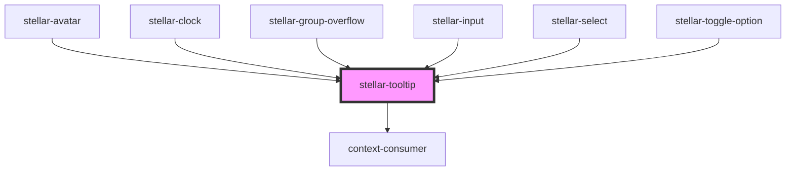

# stellar-accordian

<!-- Auto Generated Below -->

## Usage

### Align

<stellar-grid style="--grid-width: 270px">
	<stellar-button block>
		Hover over me...
		<stellar-tooltip align="top-left">
			<stellar-avatar name="William M. Riley" size="tiny" class="mr2"></stellar-avatar>
			
				William M. Riley
				<small class="db o-70">Joined Feb. 2nd</small>
			
		</stellar-tooltip>
	</stellar-button>
	<stellar-button block>
		Hover over me...
		<stellar-tooltip align="top-center">
			<stellar-avatar name="William M. Riley" size="tiny" class="mr2"></stellar-avatar>
			
				William M. Riley
				<small class="db o-70">Joined Feb. 2nd</small>
			
		</stellar-tooltip>
	</stellar-button>
	<stellar-button block>
		Hover over me...
		<stellar-tooltip align="top-right">
			<stellar-avatar name="William M. Riley" size="tiny" class="mr2"></stellar-avatar>
			
				William M. Riley
				<small class="db o-70">Joined Feb. 2nd</small>
			
		</stellar-tooltip>
	</stellar-button>
	<stellar-button block>
		Hover over me...
		<stellar-tooltip align="middle-left">
			<stellar-avatar name="William M. Riley" size="tiny" class="mr2"></stellar-avatar>
			
				William M. Riley
				<small class="db o-70">Joined Feb. 2nd</small>
			
		</stellar-tooltip>
	</stellar-button>
	<stellar-button block>
		Hover over me...
		<stellar-tooltip align="middle-right">
			<stellar-avatar name="William M. Riley" size="tiny" class="mr2"></stellar-avatar>
			
				William M. Riley
				<small class="db o-70">Joined Feb. 2nd</small>
			
		</stellar-tooltip>
	</stellar-button>
	<stellar-button block>
		Hover over me...
		<stellar-tooltip align="bottom-left">
			<stellar-avatar name="William M. Riley" size="tiny" class="mr2"></stellar-avatar>
			
				William M. Riley
				<small class="db o-70">Joined Feb. 2nd</small>
			
		</stellar-tooltip>
	</stellar-button>
	<stellar-button block>
		Hover over me...
		<stellar-tooltip align="bottom-center">
			<stellar-avatar name="William M. Riley" size="tiny" class="mr2"></stellar-avatar>
			
				William M. Riley
				<small class="db o-70">Joined Feb. 2nd</small>
			
		</stellar-tooltip>
	</stellar-button>
	<stellar-button block>
		Hover over me...
		<stellar-tooltip align="bottom-right">
			<stellar-avatar name="William M. Riley" size="tiny" class="mr2"></stellar-avatar>
			
				William M. Riley
				<small class="db o-70">Joined Feb. 2nd</small>
			
		</stellar-tooltip>
	</stellar-button>
</stellar-grid>

### Default

<stellar-button block>
	Hover over me...
	<stellar-tooltip>
		<stellar-avatar name="William M. Riley" size="tiny" class="mr2"></stellar-avatar>
		
			William M. Riley
			<small class="db o-70">Joined Feb. 2nd</small>
		
	</stellar-tooltip>
</stellar-button>

## Properties

| Property  | Attribute | Description | Type                                                                                                                                        | Default    |
| --------- | --------- | ----------- | ------------------------------------------------------------------------------------------------------------------------------------------- | ---------- |
| `align`   | `align`   |             | `"bottom-center" \| "bottom-left" \| "bottom-right" \| "center" \| "left" \| "middle-center" \| "middle-left" \| "middle-right" \| "right"` | `"center"` |
| `dark`    | `dark`    |             | `boolean`                                                                                                                                   | `false`    |
| `focused` | `focused` |             | `boolean`                                                                                                                                   | `false`    |

## Dependencies

### Used by

 - [stellar-avatar](../avatar)
 - [stellar-clock](../../helpers/clock)
 - [stellar-group-overflow](../group-overflow)
 - [stellar-input](../../forms/input)
 - [stellar-select](../../forms/select)
 - [stellar-toggle-option](../../forms/toggle-option)

### Depends on

- context-consumer

### Graph

----------------------------------------------

*Built with [StencilJS](https://stenciljs.com/)*
